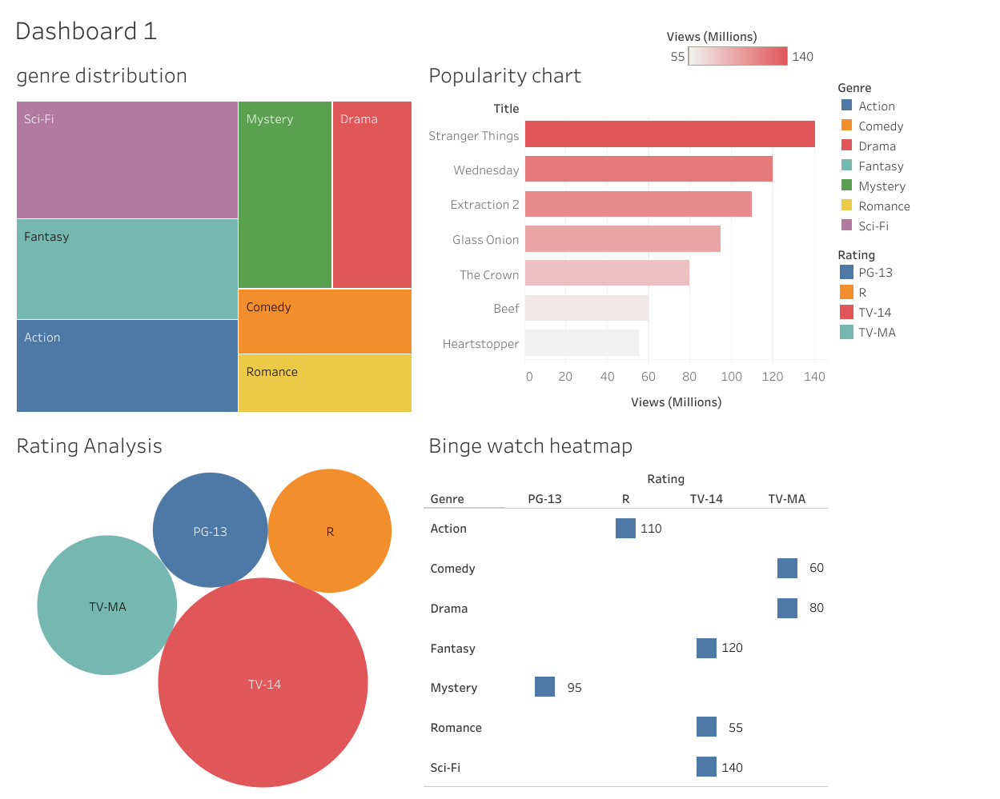

# Netflix-Content-Visualization
An interactive Tableau dashboard analyzing Netflix viewership data to identify high-performing genres, audience demographics, and content duration trends for strategic acquisition.

# Netflix Content Performance & Strategy Analysis

## 📊 Project Overview
This project leverages **Tableau** to transform raw viewership data into actionable business insights. The dashboard was designed to simulate a Content Strategy report, helping stakeholders understand the variables that drive global engagement on the platform.

## 🔗 Live Interactive Dashboard
[**Click Here to View the Interactive Dashboard on Tableau Public**](https://public.tableau.com/authoring/NetflixcontentstrategyAnalysis/Dashboard1#1)

## 🎯 Key Business Insights
* **Genre Dominance:** Analyzed viewership share to identify which genres (e.g., Sci-Fi and Fantasy) command the highest audience attention.
* **Audience Segmentation:** Visualized reach across age ratings (TV-14, TV-MA, R) to pinpoint the most engaged demographic targets.
* **Engagement Patterns:** Evaluated the correlation between show duration and total views to optimize content length for binge-watching.
* **Binge-Watch Heatmap:** Created a cross-functional grid of Genre vs. Rating to identify "Power Combinations" for future production.

## 🛠️ Technical Tools Used
* **Data Visualization:** Tableau Public
* **Data Structuring:** Excel / Google Sheets
* **Analysis Techniques:** Treemapping, Packed Bubble Charts, and Heatmap Matrixing.

## 🖼️ Dashboard Preview

